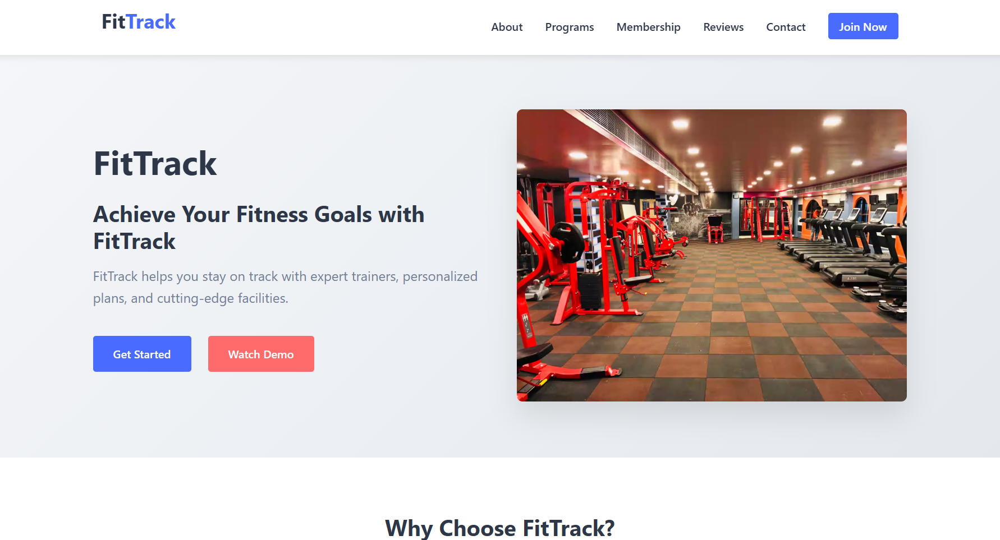

# 💪 FitTrack - Gym Management Website

FitTrack is a modern, responsive gym management website built using **HTML**, **CSS**, and **JavaScript**. It provides an engaging user interface with sections such as Hero, Features, Pricing, Testimonials, and Contact, making it ideal for fitness centers, personal trainers, and wellness brands.

---

## 🖼️ Preview

---

## 📌 Features

- ⚡ Beautiful Hero section with call-to-action buttons
- 🧩 Responsive layout using Flexbox and CSS Grid
- 📦 Reusable utility classes for margin, padding, colors, and text
- 💬 Testimonials with user images and ratings
- 💸 Pricing section with featured plan
- 📱 Fully mobile-friendly with clean responsive breakpoints
- 🎨 Styled using CSS variables for easy theming
- 📬 Contact section with form and details
- 📌 Sticky navigation bar with smooth scroll
- 🔄 Animation effects for better UX

---

## 📁 Project Structure

