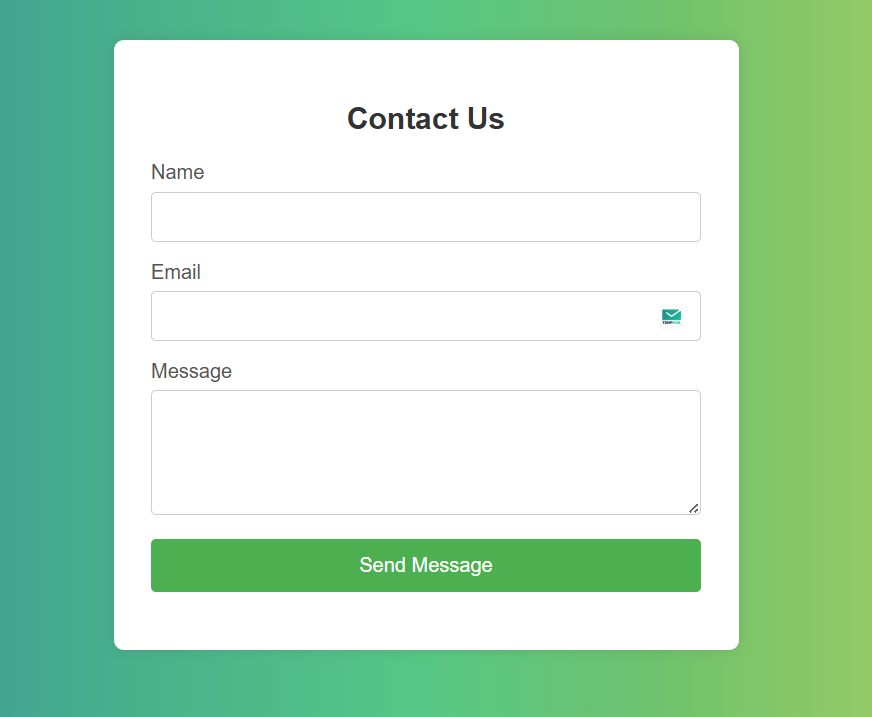

# 📨 Contact Form with JavaScript Validation

A simple and responsive contact form built using **HTML**, **CSS**, and **JavaScript** with client-side validation. The form validates the **Name**, **Email**, and **Message** fields, giving instant feedback to the user without requiring a server.

---



---

## 🚀 Features

- ✅ Real-time form validation
- ✅ Regex-based email format checking
- ✅ User-friendly error messages
- ✅ Displays a success message on valid submission
- ✅ Responsive and modern design

---

## 🛠️ Technologies Used

- HTML5
- CSS3
- JavaScript (Vanilla)

---

## 📁 Project Structure

├── index.html # Main HTML structure
├── style.css # Styles for the form
├── script.js # JavaScript validation logic
└── screenshot.png # Form screenshot


---

## 📋 Validation Rules

- **Name**: Cannot be empty
- **Email**: Must be in a valid format (e.g. `example@mail.com`)
- **Message**: Cannot be empty

---

## 🎯 How to Use

1. Clone the repository:
   ```bash
   git clone https://github.com/your-username/contact-form-validation.git

🧪 Testing Edge Cases
Submit with empty fields ❌

Enter an invalid email format (e.g. user@com) ❌

Use valid inputs ✅
